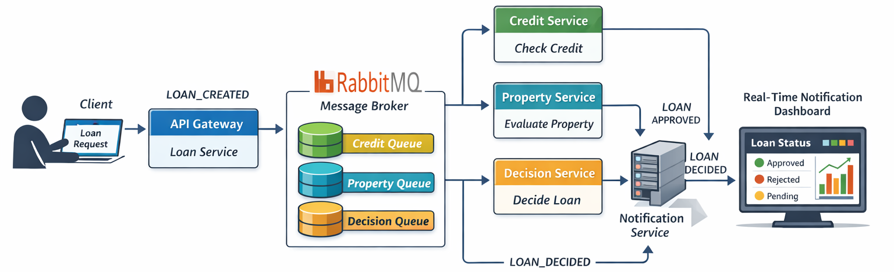

# Loan Processing Microservices System

Event-Driven Loan Processing platform built with FastAPI, RabbitMQ, Celery and Docker.

The project demonstrates how modern distributed systems handle asynchronous workflows, messaging reliability, compensation logic and real-time notifications.

---

# Architecture Overview

The system is composed of several microservices communicating through RabbitMQ events.



Services:

| Service              | Role                                            |
| -------------------- | ----------------------------------------------- |
| loan-service         | REST API to create loan requests                |
| credit-service       | Performs credit score analysis                  |
| property-service     | Estimates property value                        |
| decision-service     | Makes final loan approval decision              |
| notification-service | Stores audit logs and streams real-time updates |

---

# Exercises Summary

| Exercise | Goal                              | Key Concepts                              | Result                                                    |
| -------- | --------------------------------- | ----------------------------------------- | --------------------------------------------------------- |
| Ex1      | Build basic event-driven workflow | RabbitMQ events, service communication    | Loan lifecycle pipeline                                   |
| Ex2      | Add asynchronous processing       | Celery workers, background tasks          | Credit checks and property evaluations run asynchronously |
| Ex3      | Ensure transactional consistency  | Messaging durability, compensation logic  | Saga-like pattern for failure recovery                    |
| Ex4      | Real-time communication           | WebSockets, Server Sent Events, dashboard | Live loan status updates                                  |

---

# Exercise Details

## Exercise 1 — Event Driven Architecture

**Goal:** Create a distributed system where services communicate through events.

**Why:** Loose coupling between services allows better scalability and independent deployment.

Technologies used:

* RabbitMQ
* FastAPI
* Docker

**Results**: screenshots available [here](./results/exo-1)

---

## Exercise 2 — Asynchronous Tasks

**Goal:** Move heavy operations to background workers.

Tasks executed asynchronously:

* Credit score verification (in the credit-service)
* Property estimation (in the property-service)
* Document generation (in the decision-service)

**Why:** Long synchronous operations slow down APIs and block threads.

**Solution:** Celery workers process tasks in the background.

**Benefits:**

* Better performance
* Fault tolerance
* Horizontal scaling

**Results**: screenshots available [here](./results/exo-2)
---

## Exercise 3 — Messaging Reliability & Compensation

**Goal:** Ensure consistency if part of the workflow fails.

Example scenario:

Property evaluation fails after credit check succeeded.

**Solution:** Implement compensation logic:

```
credit_checked
      ↓
property_failed
      ↓
compensate_credit_check
```

**Benefits:**
* Avoid inconsistent system state
* Guarantee business transaction integrity

**Results**: screenshots available [here](./results/exo-3)
---

## Exercise 4 — Real-Time Notifications

**Goal:** Notify clients instantly when their loan status changes.

Technologies used:

* Server Sent Events
* WebSockets
* FastAPI streaming
* Real-time dashboard

**Features:**

* live loan approval status
* audit trail logging (a jsonl file inside the notification-service container)
* event streaming

**Results**: screenshots available [here](./results/exo-4)
---

# Running the Project

## Requirements

Install:

* Docker
* Docker Compose

---

# Start the System

From the project root:

```bash
docker compose build
docker compose up
```

This launches:

* API services
* Celery workers
* RabbitMQ
* Real-time notification service

---

# Access Points

Loan API (Swagger documentation)

```
http://localhost:8000/docs
```

RabbitMQ Management

```
http://localhost:15672
```

Default RabbitMQ login:

```
guest / guest
```

Celery monitoring (with Flower):

```
http://localhost:5555
```

Real-time Dashboard for Notifications

```
http://localhost:8001
```

---

# Testing Scenario

Step 1 — Submit Loan

```
POST http://localhost:8000/loan
```

Example request:

```json
{
  "client": "John Doe",
  "amount": 200000
}
```

---

Step 2 — Observe Processing

RabbitMQ queues and Flower process:

* credit check
* property evaluation
* final decision

---

Step 3 — Watch Real-Time Dashboard

Open:

```
http://localhost:8001
```

You will see the loan status appear instantly.

---

# Example Loan Lifecycle

```
LOAN_CREATED
      ↓
CREDIT_CHECKED
      ↓
PROPERTY_EVALUATED
      ↓
LOAN_DECIDED
      ↓
NOTIFICATION_SENT
```

---

# Audit Logs

Final loan objects are stored in:

```
notification-service/audit/loan_history.jsonl
```

Example entry:

```
{
 "loan_id": "...",
 "client": "John Doe",
 "amount": 200000,
 "credit_score": 720,
 "property_value": 250000,
 "approved": true
}
```

---

# Key Learning Outcomes

This project demonstrates:

* Event-driven microservices
* Message brokers
* Asynchronous processing
* Saga / compensation patterns
* Real-time event streaming
* Containerized distributed systems

---

# Future Improvements

Possible upgrades:

* authentication & security
* persistent databases
* API gateway
* Kubernetes deployment
* monitoring with Prometheus and Grafana
* distributed tracing

---

